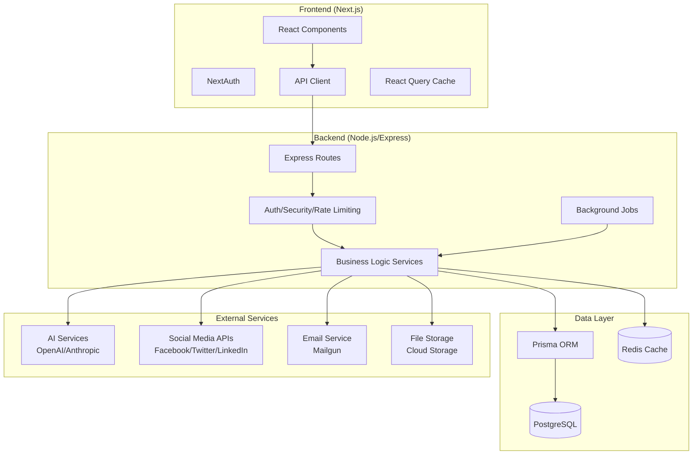

# AllIN Platform Architecture

## System Overview

AllIN is a modern social media management platform built with a **monorepo architecture** using **npm workspaces**. The platform enables users to manage multiple social media accounts, create AI-powered content, schedule posts, and analyze performance from a unified dashboard.

## Architecture Diagram



## Technology Stack

### Frontend (`/frontend`)
- **Framework**: Next.js 14.2.18 with App Router
- **UI Library**: React 18.3.1 + TypeScript 5.6.3
- **Styling**: Tailwind CSS + Radix UI components
- **State Management**: Jotai + TanStack React Query
- **Forms**: React Hook Form + Zod validation
- **Charts**: Chart.js + Recharts
- **Animation**: Framer Motion

**Key Files**:
- Entry point: `frontend/src/app/layout.tsx`
- API configuration: `frontend/src/lib/api.ts`
- Authentication: `frontend/src/app/api/auth/[...nextauth]/route.ts`

### Backend (`/backend`)
- **Runtime**: Node.js 18+ with TypeScript 5.7.2
- **Framework**: Express.js 4.21.1
- **Database**: PostgreSQL with Prisma ORM 5.22.0
- **Authentication**: JWT with custom session management
- **AI Integration**: OpenAI GPT-4 + Anthropic Claude
- **Task Queue**: Bull queue with Redis
- **Email**: Mailgun integration
- **Security**: Helmet, rate limiting, input validation

**Key Files**:
- Entry point: `backend/src/index.ts`
- Database schema: `backend/prisma/schema.prisma`
- Route definitions: `backend/src/routes/index.ts`

## Core Modules

### 1. Authentication & Authorization
**Location**: `src/services/auth.service.ts`, `src/middleware/auth.ts`

**Features**:
- JWT-based authentication with refresh tokens
- Role-based access control (RBAC)
- Session management with Redis caching
- Email verification and password reset

**User Roles**:
- `SUPER_ADMIN`: Platform administration
- `ADMIN`: Organization/workspace management
- `USER`: Standard user permissions

**Member Roles** (within organizations):
- `OWNER`: Full organization control
- `ADMIN`: User management, billing
- `EDITOR`: Content creation and publishing
- `MEMBER`: Basic content creation
- `VIEWER`: Read-only access

### 2. Social Media Management
**Location**: `src/services/social.service.ts`, `src/routes/social.routes.ts`

**Supported Platforms**:
- Facebook (Pages, Groups, Stories, Reels)
- Instagram (Feed, Stories, Reels, IGTV)
- Twitter/X (Tweets, Threads)
- LinkedIn (Personal, Company pages)
- TikTok (Videos, Stories)

**Core Features**:
- OAuth 2.0 account connection
- Multi-platform content publishing
- Queue-based scheduling system
- Optimal time recommendations
- Engagement analytics

### 3. AI Content Generation
**Location**: `src/services/ai.service.ts`, `src/routes/ai.routes.ts`

**AI Models**:
- **OpenAI GPT-4**: Content generation, improvement
- **Anthropic Claude**: Advanced reasoning, analysis
- **DALL-E 3**: Image generation (via OpenAI)

**Capabilities**:
- Platform-specific content optimization
- Hashtag generation and trending analysis
- Content improvement suggestions
- Template-based content creation
- Sentiment analysis and compliance checking

### 4. Content Scheduling & Publishing
**Location**: `src/services/scheduling.service.ts`, `src/routes/schedule.routes.ts`

**Scheduling Types**:
- **Immediate**: Publish now
- **Scheduled**: Specific date/time
- **Queue-based**: Fill predefined time slots
- **Recurring**: Daily/weekly/monthly patterns
- **Campaign**: Coordinated multi-post launches

**Queue Management**:
- Multiple queues per user/organization
- Timezone-aware scheduling
- Optimal time suggestions based on analytics
- Automatic retry logic for failed posts

### 5. Analytics & Reporting
**Location**: `src/services/analytics.service.ts`, `src/routes/analytics.routes.ts`

**Tracked Metrics**:
- Engagement rates (likes, comments, shares)
- Reach and impressions
- Follower growth
- Click-through rates
- Platform-specific metrics

**Reporting Features**:
- Custom date ranges
- Cross-platform comparisons
- Automated report generation
- Export to PDF/Excel/CSV
- White-label reports for agencies

## Data Models

### Core Entities
**Reference**: `prisma/schema.prisma`

1. **User** (`users` table)
   - Authentication and profile data
   - Role-based permissions
   - Organization memberships

2. **Organization** (`organizations` table)
   - Multi-tenant workspace isolation
   - Team collaboration features
   - Shared resources and settings

3. **SocialAccount** (`social_accounts` table)
   - Connected social media accounts
   - OAuth tokens (encrypted)
   - Account-specific settings and analytics

4. **Post** (`posts` table)
   - Content with media attachments
   - Publishing status and engagement metrics
   - Platform-specific metadata

5. **ScheduledPost** (`scheduled_posts` table)
   - Queue-based scheduling
   - Recurring post patterns
   - Publishing status tracking

## Security Architecture

### Authentication Flow
1. **Login**: Email/password → JWT access token + refresh token
2. **Session**: Redis-stored sessions with configurable TTL
3. **Authorization**: Role-based middleware checks
4. **Token Refresh**: Automatic renewal before expiration

### Data Protection
- **Encryption**: All sensitive data encrypted at rest
- **OAuth Tokens**: Stored encrypted in database
- **Rate Limiting**: Per-IP and per-user limits
- **Input Validation**: Zod schemas on all endpoints
- **CORS**: Configured for specific domains

### Security Middleware Stack
**Location**: `src/middleware/security.ts`
- Helmet for HTTP headers
- Express rate limiting
- MongoDB sanitization
- HPP (HTTP Parameter Pollution) protection
- Request logging and monitoring

## Deployment Architecture

### Development Environment
```bash
# Start full development stack
npm run dev

# Individual services
npm run dev:frontend  # Next.js dev server on :3000
npm run dev:backend   # Express server on :5000
```

### Production Environment
- **Frontend**: Static build deployed to CDN/Edge
- **Backend**: Containerized Node.js service
- **Database**: Managed PostgreSQL with read replicas
- **Cache**: Redis cluster for sessions and caching
- **Queue**: Redis-based job processing
- **Monitoring**: Application logging and metrics

## Integration Points

### External APIs
1. **Social Media Platforms**
   - Facebook Graph API
   - Instagram Basic Display API
   - Twitter API v2
   - LinkedIn API
   - TikTok for Developers API

2. **AI Services**
   - OpenAI API (GPT-4, DALL-E 3)
   - Anthropic Claude API
   - Custom model endpoints

3. **Infrastructure Services**
   - Mailgun (email delivery)
   - Cloud storage (file uploads)
   - CDN (media distribution)

### Internal APIs
**Base URL**: `/api/v1`

**Route Groups**:
- `/auth/*` - Authentication and user management
- `/social/*` - Social account and posting operations
- `/ai/*` - AI content generation and analysis
- `/schedule/*` - Scheduling and queue management
- `/analytics/*` - Performance metrics and reporting
- `/team/*` - Organization and collaboration features

## Performance Considerations

### Caching Strategy
- **Redis**: Session data, temporary tokens, rate limiting
- **React Query**: Frontend API response caching
- **Database**: Prisma query optimization and connection pooling

### Background Processing
- **Bull Queue**: Post publishing, analytics aggregation
- **Cron Jobs**: Recurring post generation, cleanup tasks
- **Event-driven**: Real-time updates via WebSockets

### Scaling Points
- **Database**: Read replicas for analytics queries
- **Queue Workers**: Horizontal scaling for background jobs
- **CDN**: Static asset distribution
- **Rate Limiting**: Distributed rate limiting with Redis

## Development Workflow

### Code Organization
```
allin-platform/
├── frontend/           # Next.js application
├── backend/            # Express.js API
├── prisma/            # Database schema and migrations
├── docs/              # Documentation
└── scripts/           # Build and deployment scripts
```

### Testing Strategy
- **Unit Tests**: Jest for services and utilities
- **Integration Tests**: API endpoint testing
- **E2E Tests**: Playwright for user workflows
- **Type Safety**: TypeScript strict mode

### Database Management
```bash
# Development migrations
npm run migrate

# Production deployment
npm run migrate:deploy

# Database seeding
npm run seed
```

## Monitoring and Observability

### Logging
**Location**: `src/middleware/security.ts:190-206`
- Structured JSON logging
- Security event tracking
- Performance monitoring
- Error aggregation

### Metrics Tracked
- API response times
- Authentication attempts
- Queue processing times
- Social media API usage
- Error rates and types

### Health Checks
**Endpoint**: `/api/health`
- Database connectivity
- Redis availability
- External API status
- Queue processing status