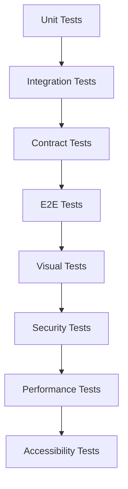

# 🔒 AllIN Platform - Bulletproof Testing Strategy

## Overview

This document outlines the comprehensive, bulletproof testing strategy for the AllIN Social Media Management Platform. Our testing approach enforces **zero tolerance for quality compromises** with automated enforcement of coverage, mutation testing, flakiness, and performance requirements.

## 🎯 Quality Standards (Non-Negotiable)

### Coverage Requirements
- **Lines**: 100% ✅
- **Branches**: 100% ✅
- **Functions**: 100% ✅
- **Statements**: 100% ✅

### Mutation Testing
- **Overall Score**: ≥90% ✅
- **Critical Files**: ≥95% ✅
- **Security/Auth Files**: ≥95% ✅

### Flakiness Tolerance
- **Retries Allowed**: 0 ✅
- **Flake Rate**: 0% ✅
- **Deterministic Tests**: Required ✅

### Performance Budgets
- **LCP (Largest Contentful Paint)**: <2.5s ✅
- **FCP (First Contentful Paint)**: <1.8s ✅
- **CLS (Cumulative Layout Shift)**: <0.1 ✅

### Security & Accessibility
- **Security Vulnerabilities**: 0 high/critical ✅
- **Accessibility Violations**: 0 WCAG 2.1 AA ✅

## 📋 Testing Architecture

### Test Layers



#### 1. Unit Tests (100% Coverage)
- **Tool**: Jest with bulletproof configuration
- **Location**: `src/**/*.test.ts`
- **Coverage**: 100% line/branch/function/statement
- **Execution**: Parallel, isolated, deterministic

#### 2. Integration Tests
- **Tool**: Jest with test containers
- **Location**: `tests/integration/`
- **Focus**: API contracts, database operations, service interactions
- **Coverage**: Component boundary validation

#### 3. End-to-End Tests (Zero Flaky)
- **Tool**: Playwright with bulletproof configuration
- **Location**: `tests/e2e/`
- **Projects**: Critical flows, browsers, accessibility, security, performance
- **Retries**: 0 (deterministic execution required)

#### 4. Mutation Testing (≥90% Score)
- **Tool**: Stryker Mutator
- **Configuration**: `stryker.conf.js`
- **Scope**: All production code
- **Threshold**: 90% minimum, 95% for critical paths

## 🛠️ Tools & Configuration

### Core Testing Stack
- **Jest**: Unit and integration testing with 100% coverage enforcement
- **Playwright**: E2E testing with zero flakiness tolerance
- **Stryker**: Mutation testing with ≥90% score requirement
- **@axe-core/playwright**: Accessibility testing
- **GitHub Actions**: CI/CD pipeline with quality gates

### Configuration Files
- `jest.config.bulletproof.js` - Enforces 100% coverage
- `playwright.config.bulletproof.ts` - Zero flaky tests configuration
- `stryker.conf.js` - ≥90% mutation score enforcement
- `tests/coverage-map.json` - Complete code inventory
- `tests/coverage-exceptions.yml` - Time-boxed exceptions

## 🚀 Quick Start Commands

### Development
```bash
# Install dependencies with bulletproof testing tools
npm ci

# Run all tests locally
npm run test:all

# Run tests with coverage
npm run test:coverage

# Run mutation testing
npm run test:mutation

# Run E2E tests
npm run test:e2e

# Open comprehensive test reports
npm run reports:open
```

### Continuous Integration
```bash
# Run CI-optimized test suite
npm run test:ci

# Security testing
npm run test:security

# Accessibility testing
npm run test:accessibility

# Performance testing
npm run test:performance
```

## 📊 Test Data Management

### Deterministic Testing
- **Time Mocking**: Fixed date `2024-01-15T10:00:00.000Z`
- **Random Seeding**: Consistent seed `12345`
- **Network Mocking**: Hermetic test execution
- **Database Seeding**: Predictable test data

### Test Factories
```typescript
// Create deterministic test data
const user = createTestUser({
  email: 'test@example.com',
  role: 'admin'
});

const post = createTestPost({
  title: 'Test Post',
  published: true
});
```

## 🔒 Security Testing

### Automated Scans
- **Dependency Vulnerabilities**: `npm audit`
- **SAST**: Static analysis with Super Linter
- **Secret Detection**: TruffleHog scanning
- **Security Headers**: Automated validation

### Security Test Cases
- Authentication bypass attempts
- Authorization boundary violations
- Input injection attacks
- Rate limiting validation
- Session security verification

## ♿ Accessibility Testing

### WCAG 2.1 AA Compliance
- **Tool**: @axe-core/playwright
- **Coverage**: All critical user interfaces
- **Violations**: Zero tolerance
- **Manual Testing**: Keyboard navigation, screen readers

### Accessibility Test Matrix
| Page | Keyboard Nav | Screen Reader | Color Contrast | Focus Management |
|------|-------------|---------------|----------------|------------------|
| Login | ✅ | ✅ | ✅ | ✅ |
| Dashboard | ✅ | ✅ | ✅ | ✅ |
| Content Creation | ✅ | ✅ | ✅ | ✅ |

## ⚡ Performance Testing

### Performance Budgets
| Metric | Budget | Monitoring |
|--------|--------|------------|
| LCP | <2.5s | Lighthouse CI |
| FCP | <1.8s | Playwright tracing |
| CLS | <0.1 | Visual stability |
| TTI | <3.5s | User interaction |

### Performance Test Scenarios
- Critical user journeys under load
- Network throttling simulation
- Memory leak detection
- Bundle size monitoring

## 🚪 Quality Gates

### CI/CD Pipeline Gates
1. **Pre-flight**: Linting, type checking, formatting
2. **Unit Tests**: 100% coverage enforcement
3. **Mutation Testing**: ≥90% score requirement
4. **E2E Tests**: Zero flaky tests tolerance
5. **Security**: No high/critical vulnerabilities
6. **Accessibility**: Zero WCAG violations
7. **Performance**: Budget compliance
8. **Quality Gate**: All requirements must pass

### Merge Blocking Conditions
- Coverage below 100% (with documented exceptions)
- Mutation score below 90%
- Any flaky test detected
- Security vulnerabilities present
- Accessibility violations found
- Performance budgets exceeded

## 📈 Reporting & Monitoring

### Test Reports
- **Coverage**: HTML reports with line-by-line analysis
- **Mutation**: Survived mutant analysis
- **E2E**: Video/trace capture on failures
- **Performance**: Lighthouse reports
- **Accessibility**: axe violation details

### Dashboard Integration
- GitHub PR status checks
- Coverage trend monitoring
- Flake rate tracking
- Performance regression alerts

## 🔧 Troubleshooting

### Common Issues

#### Coverage Not 100%
1. Check `tests/coverage-map.json` for missing files
2. Review exclusions in `jest.config.bulletproof.js`
3. Add tests for uncovered branches
4. Document justified exceptions in `coverage-exceptions.yml`

#### Mutation Score Below 90%
1. Review survived mutants in mutation report
2. Strengthen test assertions
3. Add property-based tests for complex logic
4. Consider equivalent mutant marking

#### Flaky Test Detection
1. Check test isolation and cleanup
2. Verify deterministic time/random seeding
3. Review async operations and waits
4. Use `tests/utils/test-setup.ts` utilities

#### Performance Budget Failures
1. Analyze Lighthouse reports
2. Review bundle size and dependencies
3. Optimize critical rendering path
4. Implement code splitting

## 📚 Best Practices

### Test Writing Guidelines
1. **Write deterministic tests**: Use fixed time, seeded randomness
2. **Test behaviors, not implementation**: Focus on public APIs
3. **Use property-based testing**: For complex algorithms
4. **Mock external dependencies**: Ensure hermetic execution
5. **Test error paths**: Don't just test happy paths

### Maintenance
1. **Review exceptions quarterly**: Reduce coverage exceptions
2. **Monitor flake rates**: Address any trending issues
3. **Update performance budgets**: As application grows
4. **Security scan dependencies**: Regular vulnerability updates

## 🎯 Success Metrics

### Key Performance Indicators
- **Code Coverage**: 100% maintained
- **Mutation Score**: ≥90% maintained
- **Flake Rate**: 0% maintained
- **Build Success Rate**: >99%
- **Security Vulnerabilities**: 0 high/critical
- **Performance Regressions**: <5% budget deviation

### Quality Trends
- Coverage trend over time
- Mutation score improvements
- Test execution time optimization
- Flake elimination progress

---

## 📞 Support

For questions about the testing strategy or implementation:

1. **Documentation**: This file and inline code comments
2. **Test Utilities**: See `tests/utils/` for helper functions
3. **Configuration**: Review config files for customization
4. **CI/CD Issues**: Check GitHub Actions workflow logs

**Remember**: This is a **bulletproof** testing strategy with **zero tolerance** for quality compromises. Every requirement is enforced automatically through CI/CD gates.